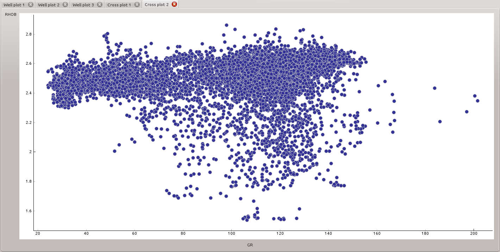
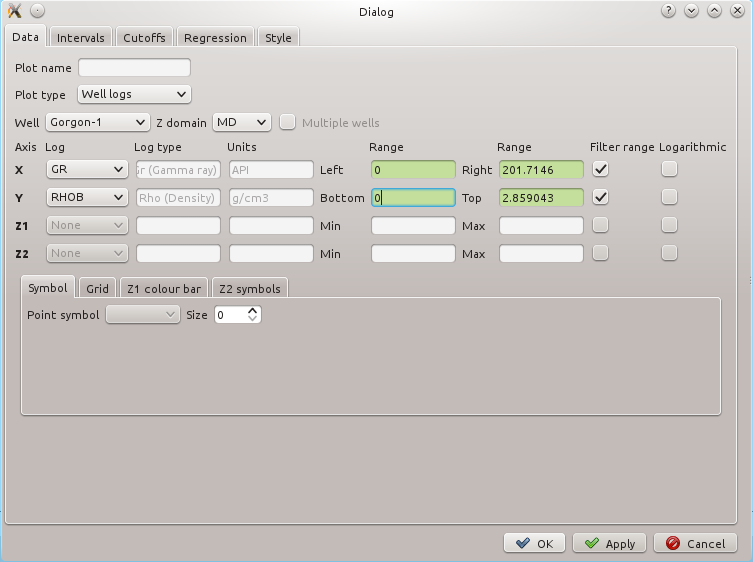
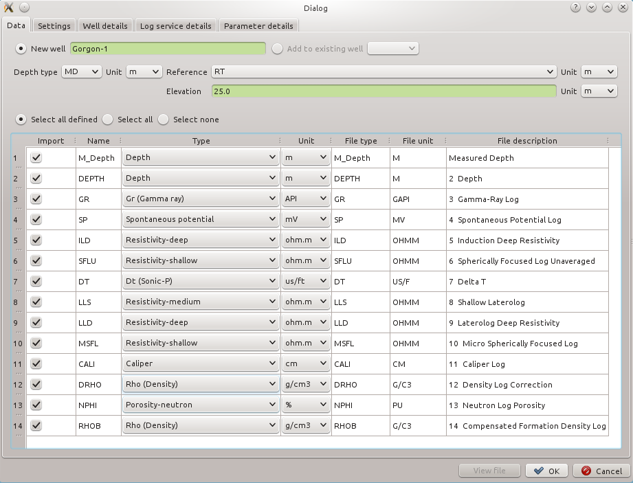

# qreservoir

Petrophysics application build with PyQt4, python3.4.

Contains basic structure for wells and log objects that can be used to build upon with petrophysics and rock physics logic.

## Well log plots

## Cross plots

## Cross plot setup

## .las/ascii import

